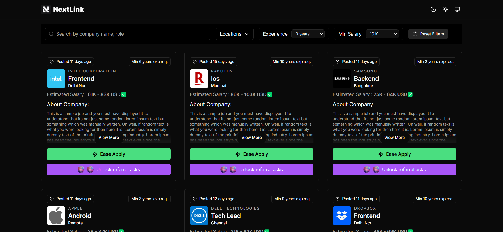

# Nextlink | Job Listing Platform



Nextlink is a web application built as a part of Weekday's Frontend Interview Assignment.
 Nextlink is a  job listing platform designed to connect job seekers with their next opportunity. Utilizing the power of React, Next.js 14, Tailwind the platform offers a fast, responsive, and accessible user experience.


</br>

## Features
- **🔄 Infinite Scroll**: Automatically load more job listings as you scroll down, enhancing user experience by providing a seamless browsing experience.

- **🔍Job Search**: Browse and use multiple filter to find hundreds of job listings that you need.
- **📱Responsive web application**: Optimized for a smooth experience on any device.
- **Font Optimization**: Uses [`next/font`](https://nextjs.org/docs/basic-features/font-optimization) for enhanced text readability.

## Installation and Setup

Follow these steps to get your development environment set up:

1. **Clone the repository:**
   ```bash
   git clone https://github.com/your-repository/nextlink.git
   cd nextlink
   ```

2. **Install dependencies:**
   ```bash
   npm install
   # or
   yarn install
   # or
   pnpm install
   ```

3. **Run the development server:**
   ```bash
   npm run dev
   # or
   yarn dev
   # or
   pnpm dev
   ```

4. **Open your browser and visit:**
   [http://localhost:3000](http://localhost:3000)

## Editing the Application

To make changes to the application, start by editing the `app/page.tsx` file.
To further customize the application, you can explore the following files and directories:

- `components/`: Contains all React components used throughout the application. Modify or add new components as needed.
- `styles/`: Houses the Tailwind CSS files. Adjust styles here to change the look and feel of your application.
- `hooks/useJobSearch.ts`: This directory contains all the API calling and functions. You can add new api endpoints or modify existing ones to change backend behavior.
- `public/`: Contains static files like images and fonts. Add more or replace existing files to suit your branding needs.

Remember to regularly commit your changes to your Git repository to keep track of the modifications and ensure that you can revert to previous versions if necessary.

## Learn More About Next.js and Tailwind

To deepen your understanding of Next.js and its capabilities, consider exploring the following resources:

- [Next.js Documentation](https://nextjs.org/docs) - Comprehensive guide on Next.js features and API.
- [Learn Next.js](https://nextjs.org/learn) - An interactive tutorial to learn Next.js step-by-step.
- [Tailwind CSS](https://tailwindcss.com/) -  A utility-first CSS framework for rapidly building custom user interfaces.


## Deployment

Deploy your Next.js app effortlessly using the [Vercel Platform](https://vercel.com/new?utm_medium=default-template&filter=next.js&utm_source=create-next-app&utm_campaign=create-next-app-readme), directly integrated with the creators of Next.js. For more detailed instructions, visit our [Next.js deployment documentation](https://nextjs.org/docs/deployment).


</br>

<h3 align="center">💫  Made with ❤️ by <a href="https://thegagan-portfolio.vercel.app/">Gagan Kumar</a> 🔥 </h3>
<p align="center"> 🤙 +91-9036644552  |    <a href="mailto:hellothegagan@gmail.com">hellothegagan@gmail.com</a> 📫</p>
</center>